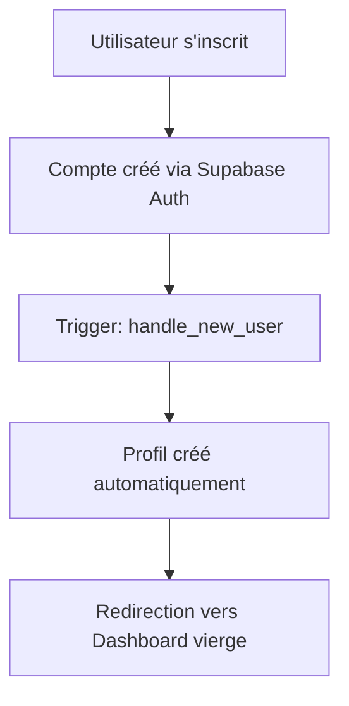
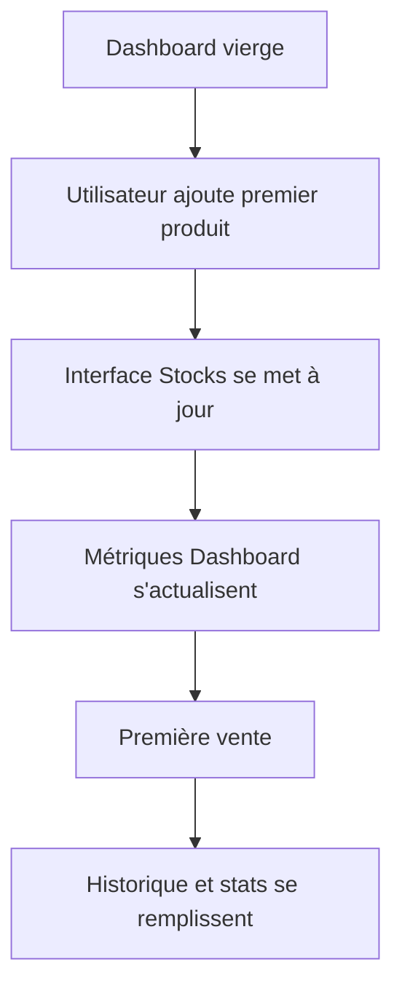

# 🏗️ Architecture SaaS Multi-Tenant

## 📊 Vue d'ensemble

Cette application implémente une architecture **multi-tenant parfaitement isolée** où chaque utilisateur dispose de sa propre interface personnalisée basée sur ses données exclusives.

## 🔒 Sécurité & Isolation des Données

### 1. Row Level Security (RLS) Supabase

**Toutes les ta bles** sont protégées par des politiques RLS strictes :

```sql
-- Exemple : Table products
CREATE POLICY "Users can manage their own products" 
ON public.products 
FOR ALL 
USING (auth.uid() = user_id) 
WITH CHECK (auth.uid() = user_id);
```

### 2. Tables Isolées par Utilisateur

| Table | Description | Isolation |
|-------|-------------|-----------|
| `products` | Inventaire produits | ✅ Par `user_id` |
| `sales` | Transactions de vente | ✅ Par `user_id` |
| `payments` | Encaissements | ✅ Par `user_id` |
| `profiles` | Profils utilisateurs | ✅ Par `user_id` |
| `user_roles` | Rôles système | ✅ Par `user_id` |

### 3. Requêtes Sécurisées Automatiques

**Hooks React personnalisés** avec filtrage automatique :

```typescript
// useProducts.ts - Exemple de requête sécurisée
const { data: products } = useQuery({
  queryKey: ['products', user?.id],
  queryFn: async () => {
    const { data, error } = await supabase
      .from('products')
      .select('*')
      // RLS applique automatiquement WHERE user_id = auth.uid()
      .order('created_at', { ascending: false });
    
    if (error) throw error;
    return data || [];
  },
  enabled: !!user,
});
```

## 🎯 Interface Utilisateur Personnalisée

### 1. État Initial Vierge

**Nouveaux utilisateurs** arrivent sur une interface complètement vide :

- ✅ Dashboard avec métriques à zéro
- ✅ Stocks sans produits
- ✅ Ventes sans historique
- ✅ Paiements sans transactions
- ✅ Rapports sans données

### 2. Interface Évolutive

L'interface se **remplit progressivement** selon les actions :

```typescript
// Dashboard.tsx - Métriques dynamiques
const metrics = useMemo(() => {
  const totalProducts = products.length; // 0 au début
  const totalSales = sales.reduce((sum, sale) => sum + sale.total_amount, 0);
  // ...
}, [products, sales, payments]);
```

### 3. Gestion des États Vides

**Messages adaptatifs** selon l'état de l'utilisateur :

```tsx
// RecentActivity.tsx
{activities.length === 0 ? (
  <div className="text-center py-8">
    <AlertTriangle className="h-8 w-8 text-muted-foreground mx-auto mb-3" />
    <p className="text-sm text-muted-foreground">
      Aucune activité récente
    </p>
    <p className="text-xs text-muted-foreground mt-1">
      Commencez par ajouter des produits et effectuer des ventes
    </p>
  </div>
) : (
  // Afficher les activités...
)}
```

## 🛡️ Couches de Sécurité

### Niveau 1 : Authentification
- ✅ Supabase Auth avec email/password
- ✅ Sessions sécurisées avec tokens JWT
- ✅ Protection des routes avec `ProtectedRoute`

### Niveau 2 : Base de Données
- ✅ Politiques RLS sur toutes les tables
- ✅ Triggers automatiques pour la cohérence
- ✅ Fonctions sécurisées avec `SECURITY DEFINER`

### Niveau 3 : Application
- ✅ Context `AuthProvider` centralisé
- ✅ Hooks avec requêtes filtrées automatiquement
- ✅ Composants qui s'adaptent aux données utilisateur

### Niveau 4 : Interface
- ✅ Affichage conditionnel basé sur les données
- ✅ Messages d'état vide personnalisés
- ✅ Métriques calculées en temps réel

## 📁 Structure des Fichiers

```
src/
├── components/
│   ├── auth/ProtectedRoute.tsx      # Protection des routes
│   ├── dashboard/MetricCard.tsx     # Métriques utilisateur
│   ├── dashboard/RecentActivity.tsx # Activités personnalisées
│   └── layout/AppLayout.tsx         # Layout avec auth
├── contexts/
│   └── AuthContext.tsx              # Gestion auth globale
├── hooks/
│   ├── useProducts.ts               # CRUD produits sécurisé
│   ├── useSales.ts                  # CRUD ventes sécurisé
│   └── usePayments.ts               # CRUD paiements sécurisé
├── pages/
│   ├── Dashboard.tsx                # Vue d'ensemble personnalisée
│   ├── Stocks.tsx                   # Inventaire utilisateur
│   ├── Ventes.tsx                   # Historique ventes
│   └── Rapports.tsx                 # Exports personnalisés
└── integrations/supabase/
    ├── client.ts                    # Client Supabase configuré
    └── types.ts                     # Types générés automatiquement
```

## 🚀 Flux Utilisateur

### 1. Inscription


### 2. Première Utilisation


## 🔧 Configuration Technique

### Variables d'Environnement
```env
# Supabase (automatiquement configuré)
SUPABASE_URL=https://fsdfzzhbydlmuiblgkvb.supabase.co
SUPABASE_ANON_KEY=eyJhbGciOiJIUzI1NiIs...
```

### Déploiement
- ✅ **Frontend** : Déployé automatiquement via Lovable
- ✅ **Base de données** : Supabase hébergé
- ✅ **Authentification** : Gérée par Supabase Auth
- ✅ **Migrations** : Versionnées et appliquées automatiquement

## 📊 Exemple de Flux de Données

```typescript
// 1. Utilisateur connecté
const { user } = useAuth(); // user.id = UUID unique

// 2. Requête automatiquement filtrée
const { products } = useProducts(); // SELECT * FROM products WHERE user_id = user.id

// 3. Interface personnalisée
const totalProducts = products.length; // Métriques spécifiques à l'utilisateur

// 4. Aucune donnée externe accessible
// Impossible d'accéder aux données d'autres utilisateurs
```

## ✅ Tests de Sécurité

### Isolation Vérifiée
- [ ] Utilisateur A ne peut pas voir les données de B
- [ ] Requêtes API retournent uniquement les données de l'utilisateur authentifié
- [ ] Interface vierge pour nouveaux comptes
- [ ] Métriques correctes après ajout de données

### Points de Contrôle
1. **Test RLS** : Tentative d'accès direct aux données d'un autre utilisateur
2. **Test API** : Appels avec tokens différents
3. **Test Interface** : Vérification des états vides et remplis
4. **Test Migration** : Nouveaux utilisateurs ont des données isolées

---

**🎯 Résultat** : Architecture multi-tenant complètement sécurisée avec isolation parfaite des données et interface personnalisée par utilisateur.